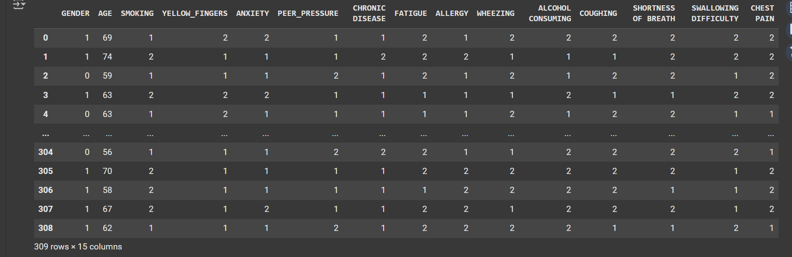
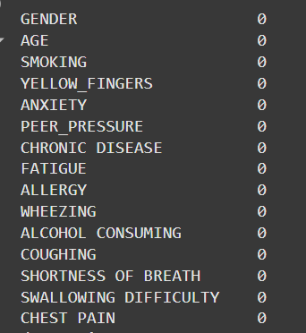
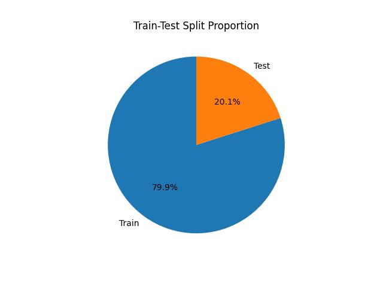

# Lung Cancer Prediction Model

This project applies machine learning techniques to predict the likelihood of lung cancer based on survey data. The model aims to assist in early cancer detection by analyzing key factors related to lung cancer risk.


## Overview
Lung cancer is a significant health issue globally, and early detection is crucial for effective treatment. This model leverages data science methods to predict lung cancer likelihood with an accuracy of 90.32% using the survey_lung_cancer dataset.

To run this notebook, ensure you have the following libraries installed:

- `pandas` - For data loading and manipulation
- `numpy` - For numerical operations
- `scikit-learn` - For machine learning tasks
## Key Features
Accuracy: Achieves an accuracy of 90.32% on the survey lung cancer dataset.
Technologies Used: Python, Scikit-Learn, Pandas, and other data science libraries.

## Dataset
The dataset includes a variety of features related to lung cancer risk factors:

- GENDER: Gender of the individual (encoded from string to - -  numerical values)
- AGE: Age of the individual
- SMOKING: Smoking habits
- YELLOW_FINGERS: Presence of yellow fingers (a potential smoking-related sign)
- ANXIETY: Anxiety levels
- PEER_PRESSURE: Influence of peer pressure
- CHRONIC DISEASE: Presence of chronic diseases
- FATIGUE: Level of fatigue
- ALLERGY: History of allergies
- WHEEZING: Wheezing symptoms
- ALCOHOL CONSUMING: Alcohol consumption habits
- COUGHING: Frequency of coughing
- SHORTNESS OF BREATH: Experience of shortness of breath
- SWALLOWING DIFFICULTY: Difficulty in swallowing
- CHEST PAIN: Experience of chest pain
- LUNG_CANCER: Target variable indicating the presence of lung cancer


## Analysis Steps
**Data Preparation:**
- Load the dataset using Pandas.
- Check dataset shape and structure.
```bash
import pandas as pd
from sklearn.model_selection import train_test_split
from sklearn.preprocessing import LabelEncoder
from sklearn.ensemble import RandomForestClassifier
from sklearn.metrics import accuracy_score, classification_report
from sklearn.linear_model import LogisticRegression
from sklearn.preprocessing import StandardScaler
```
```bash
df=pd.read_csv('/content/survey lung cancer.csv')
df
df.shape
```
| GENDER | AGE | SMOKING | YELLOW_FINGERS | ANXIETY | PEER_PRESSURE | CHRONIC_DISEASE | FATIGUE | ALLERGY | WHEEZING | ALCOHOL_CONSUMING | COUGHING | SHORTNESS_OF_BREATH | SWALLOWING_DIFFICULTY | CHEST_PAIN | LUNG_CANCER |
|--------|-----|---------|----------------|---------|---------------|-----------------|---------|---------|----------|-------------------|----------|---------------------|-----------------------|------------|-------------|
| M      | 69  | 1       | 2              | 2       | 1             | 1               | 2       | 1       | 2        | 2                 | 2        | 2                   | 2                     | 2          | YES         |
| M      | 74  | 2       | 1              | 1       | 1             | 2               | 2       | 2       | 1        | 1                 | 1        | 2                   | 2                     | 2          | YES         |
| F      | 59  | 1       | 1              | 1       | 2             | 1               | 2       | 1       | 2        | 1                 | 2        | 2                   | 1                     | 2          | NO          |
| M      | 63  | 2       | 2              | 2       | 1             | 1               | 1       | 1       | 1        | 2                 | 1        | 1                   | 2                     | 2          | NO          |
| F      | 63  | 1       | 2              | 1       | 1             | 1               | 1       | 1       | 2        | 1                 | 2        | 2                   | 1                     | 1          | NO          |
| ...    | ... | ...     | ...            | ...     | ...           | ...             | ...     | ...     | ...      | ...               | ...      | ...                 | ...                   | ...        | ...         |
| F      | 56  | 1       | 1              | 1       | 2             | 2               | 2       | 1       | 1        | 2                 | 2        | 2                   | 2                     | 1          | YES         |
| M      | 70  | 2       | 1              | 1       | 1             | 1               | 2       | 2       | 2        | 2                 | 2        | 2                   | 1                     | 2          | YES         |
| M      | 58  | 2       | 1              | 1       | 1             | 1               | 1       | 2       | 2        | 2                 | 2        | 1                   | 1                     | 2          | YES         |
| M      | 67  | 2       | 1              | 2       | 1             | 1               | 2       | 2       | 1        | 2                 | 2        | 2                   | 1                     | 2          | YES         |
| M      | 62  | 1       | 1              | 1       | 2             | 1               | 2       | 2       | 2        | 2                 | 1        | 1                   | 2                     | 1          | YES         |
309 rows × 16 columns


**Split X and Y data**

```bash
X=df.iloc[:,0:15]
Y=df.iloc[:,-1]
```
**Target variable**


**Preprocessing:**
- Label encode the Gender column.
- Check for and handle any missing values.
  
##Encoding
Converts the categorical "GENDER" column in the X DataFrame into numerical values using Label Encoding. The LabelEncoder() from sklearn.preprocessing is used to assign a unique integer to each category (e.g., "Male" = 0, "Female" = 1). This transformation is stored back in the "GENDER" column of X.

```bash
# Convert categorical Gender column to numerical using Label Encoding
label_encoder = LabelEncoder()
X['GENDER'] = label_encoder.fit_transform(X['GENDER'])
X
```
**After Label Encoding:**


**Checking Null Values**
```bash
# Check for any remaining non-numeric values or NaN
print(X.isnull().sum())  # Check for missing values
print(X.dtypes)  # Check data types again
```


**Modeling:**
- Split the data into training and test sets.
- Train a logistic regression model on the training data.

This code splits the data into training and testing sets, with 80% for training and 20% for testing. The split is done randomly, but the random_state=0 ensures consistent results each time.
```bash
from sklearn.model_selection import train_test_split
X_train,X_test,Y_train,Y_test=train_test_split(X,Y,test_size=0.2,random_state=0)
```
Display a pie chart showing the percentage of data used for training and testing, helping you visualize the split:

```bash
import matplotlib.pyplot as plt

# Plot the proportion of training and testing data
labels = ['Train', 'Test']
sizes = [len(X_train), len(X_test)]
plt.pie(sizes, labels=labels, autopct='%1.1f%%', startangle=90)
plt.title('Train-Test Split Proportion')
plt.savefig('bar.jpg')
plt.show()
```


## Model Training: Logistic Regression
Initializes and trains a Logistic Regression model using the training data (X_train and Y_train). The model learns the relationship between the features and the target variable.

```bash
model = LogisticRegression()
model.fit(X_train, Y_train)
```
**Make predictions**
```bash
Y_pred = model.predict(X_test)
```
**Evaluate the model**
```bash
# Evaluate the model
accuracy_lr = accuracy_score(Y_test, Y_pred)
print(f"Logistic Regression Accuracy: {accuracy_lr:.2f}")

#Precision score: the ratio of correctly predicted positive observations to the total predicted positives
print("Precision:", precision_score(Y_test, Y_pred, average='weighted'))

#Recall score: the ratio of correctly predicted positives to all observations in the actual class
print("Recall:", recall_score(Y_test, Y_pred, average='weighted'))

#F1 Score: the harmonic mean of precision and recall, balancing both metrics
print("F1 Score:", f1_score(Y_test, Y_pred, average='weighted'))
```
**Confusion Matrix**
The confusion matrix tells you how many predictions were correct or incorrect:
- True Positive (TP): Correctly predicted "Real" articles.
- True Negative (TN): Correctly predicted "Fake" articles.
- False Positive (FP): Incorrectly predicted "Real" for a "Fake" article.
- False Negative (FN): Incorrectly predicted "Fake" for a "Real" article.
  
```bash
# Generate confusion matrix
cm = confusion_matrix(Y_test, Y_pred)
import seaborn as sns

# Plot confusion matrix
sns.heatmap(cm, annot=True, fmt='d', cmap='Blues', xticklabels=['No Cancer', 'Cancer'], yticklabels=['No Cancer', 'Cancer'])
plt.title('Confusion Matrix - Lung Cancer Prediction')
plt.xlabel('Predicted')
plt.ylabel('True')
plt.savefig('confusion matrix.png')
plt.show()
```


**Classification Report: detailed metrics for each class, including precision, recall, F1 score, and support:**

```bash
report = classification_report(Y_test, Y_pred, output_dict=True)

# Convert the classification report to a DataFrame
report_df = pd.DataFrame(report).transpose()

# Plot the classification report as a heatmap
plt.figure(figsize=(8, 6))
sns.heatmap(report_df.iloc[:-1, :].T, annot=True, cmap='Blues', fmt='.2f', cbar=True)
plt.title('Classification Report - Lung Cancer Prediction')
plt.savefig('Lr report.png')
plt.show()
```


## Model Training: Decision Tree
This code trains a Decision Tree model and tests its performance on the data, showing accuracy and other important metrics. It creates a classification report with precision, recall, and F1-score for each class, then visualizes these metrics as a heatmap. The heatmap makes it easy to see how well the model is doing for each class.
```bash
# Train the Decision Tree model
from sklearn.tree import DecisionTreeClassifier

model_dt = DecisionTreeClassifier()
model_dt.fit(X_train, Y_train)

# Make predictions
Y_pred_dt = model_dt.predict(X_test)

# Evaluate accuracy
accuracy_dt = accuracy_score(Y_test, Y_pred_dt)
print(f"Decision Tree Accuracy: {accuracy_dt:.2f}")
```
Output:
```bash
Decision Tree Accuracy: 0.90
```
**Classification Report: detailed metrics for each class, including precision, recall, F1 score, and support:**

```bash
# Print precision, recall, f1-score, and support report
report = classification_report(Y_test, Y_pred_dt)

# Plot the classification report as a heatmap
plt.figure(figsize=(10, 6))
sns.heatmap(report_df.iloc[:-1, :3], annot=True, cmap='Blues', fmt='.2f', cbar=True)
plt.title('Classification Report - Decision Tree Model')
plt.savefig('DT report.png')
plt.show()
```


## How to Use
1. Clone this repository:
```bash
https://github.com/himeldas23/Survey_Lung_Cancer.git
```
2. Navigate to the project directory:
```bash
cd Survey_Lung_Cancer
```
3. Install Dependencies:
```bash
pip install -r requirements.txt
```
4. Run the Notebook or Script:\
Open the survey_lung_cancer.ipynb notebook and run each cell to load the dataset and execute the analysis steps.
## Future Improvements
- Experiment with additional algorithms to potentially improve accuracy.
- Explore new features or external datasets to expand predictive power.
- Integrate visualizations to better understand feature importance.
## Contributing

Contributions are always welcome!

See `contributing.md` for ways to get started.

Please adhere to this project's `code of conduct`.

